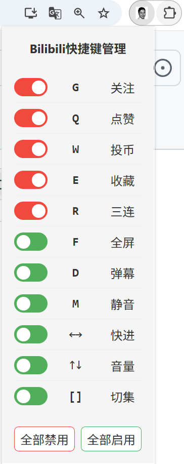

# BilibiliHotkeyManager
Chrome插件-Bilibili快捷键管理器
## 
## ⚙️功能
* 对Bilibili自带播放器的每个快捷键进行单独启用管理，以防止误触和冲突
* 不会对其他插件的快捷键造成影响
* G 关注
* Q 点赞
* W 投币
* E 收藏
* R 三连
* F 全屏
* D 弹幕
* M 静音
* ←→ 快进
* ↑↓ 音量
* [] 切集
* ⚠️目前只支持Chromium内核的浏览器(Chrome、Edge等)，暂不支持Firefox和Safari
## 🔧安装
* git clone 或 直接下载zip并解压
* 拓展程序 -> 管理拓展程序 -> 启用开发者模式
* -> 加载未打包的拓展程序 -> 加载BilibiliHotkeyManager目录
